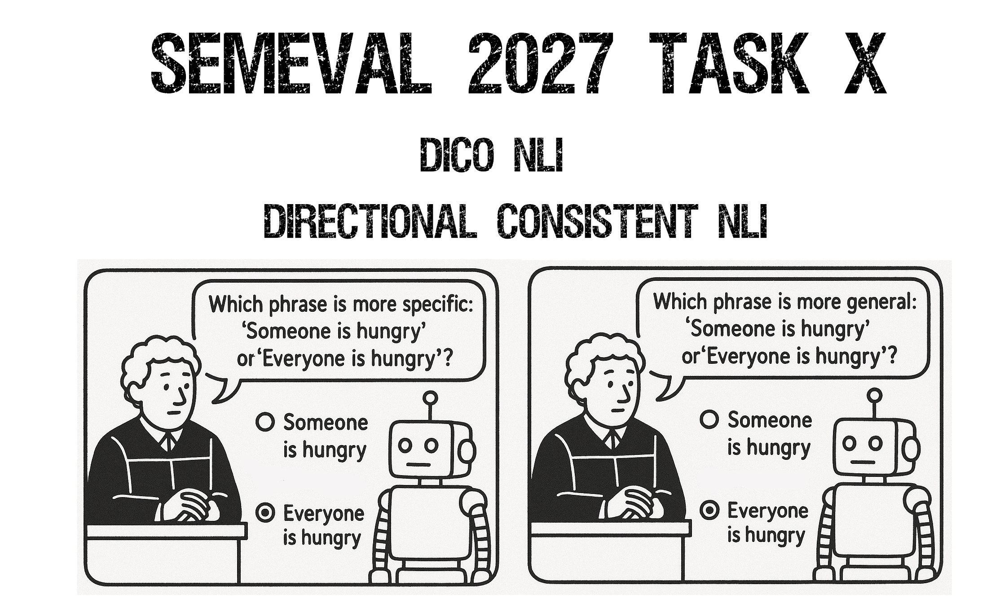

<p align="center" style="overflow: hidden; max-height: 420px;">
  
</p>

# SemEval 2027 Task X: Consistency-Aware Compositional Fine-Grained Natural Language Inference (CoCo-NLI)

CoCo-NLI is a SemEval-2027 shared task on **directional inferential consistency** in fine-grained Natural Language Inference (NLI).

The task is inspired by the Reversal Curse, but it does **not** directly test parametric knowledge reversal in the Berglund et al. sense. Instead, it evaluates whether a system assigns logically compatible NLI labels when an ordered phrase pair is reversed.

**If you use our data, please cite:**

```bibtex
TODO: add official task citation once available.
```

- **Competition website:** TODO: CodaBench link.
- **Questions or issues:** open a [GitHub issue](https://github.com/ilopezgazpio/SemEval-2027-Task-X-CoCo-NLI/issues) or email `inigo.lopez@ehu.eus`.
- **Data release:** TODO: Zenodo link.
- **Task status:** conditionally accepted for SemEval 2027.

# News

TODO.

# Task Description

Standard NLI benchmarks usually evaluate whether a model predicts the correct label for a single ordered pair. CoCo-NLI adds a paired requirement: if a model predicts a relation for `(premise, hypothesis)`, its prediction for `(hypothesis, premise)` should be compatible with the logical reversal of that relation.

The task uses short phrase pairs derived from PhrasIS, a fine-grained phrase inference and similarity benchmark built from naturally occurring image captions and news headlines. CoCo-NLI focuses on the reversible subset of PhrasIS:

| Label | Reversed label |
|-------|----------------|
| `EQUIVALENCE` | `EQUIVALENCE` |
| `FORWARD_ENTAILMENT` | `BACKWARD_ENTAILMENT` |
| `BACKWARD_ENTAILMENT` | `FORWARD_ENTAILMENT` |

Example:

| Premise | Hypothesis | Label |
|---------|------------|-------|
| `Everyone is hungry` | `Someone is hungry` | `FORWARD_ENTAILMENT` |
| `Someone is hungry` | `Everyone is hungry` | `BACKWARD_ENTAILMENT` |

This design probes whether models rely on shallow similarity cues or maintain direction-aware semantic structure. A model may be correct on isolated items but inconsistent under reversal; it may also be internally consistent but wrong. CoCo-NLI reports both behaviors explicitly.

The task will release trial and final data under a documented `data/` folder once the task package is ready. The expected structure is:

```text
data/
  trial/
    README.md
    ...
  final/
    README.md
    ...
```

The data documentation will specify label distributions, source provenance, split construction, multilingual translation/adjudication details, and contamination-control notes.

# Tracks

CoCo-NLI will include four tracks.

| Track | Name | Description |
|-------|------|-------------|
| 1 | English | Monolingual English phrase-pair NLI. |
| 2 | Spanish | Monolingual Spanish phrase-pair NLI. |
| 3 | Basque | Monolingual Basque phrase-pair NLI. |
| 4 | Mixed multilingual | Premise and hypothesis may appear in any EN/ES/EU language combination. This track targets cross-lingual directional consistency. |

The Spanish and Basque data will be produced from the English source items through translation plus bilingual expert verification. Verification will check not only translation fidelity, but also whether the directional entailment relation is preserved after translation. Items whose logical relation is unstable after translation will be corrected, relabeled if appropriate, or removed from the official split.

# Evaluation

Systems must predict one label for every ordered phrase pair:

```text
EQUIVALENCE
FORWARD_ENTAILMENT
BACKWARD_ENTAILMENT
```

The official scorer will report:

| Metric | What it measures |
|--------|------------------|
| `F-measure` | Standard label-prediction quality. The final scorer will document whether the official variant is weighted, macro, or a combination. |
| `SoftCons` | Directional self-consistency under the reversal operator, independent of gold correctness. |
| `HardCons` | Paired correctness under reversal: both directions must be predicted correctly. Because the reversed gold label is deterministic, this is a strict paired-accuracy/consistency measure. |

For an item `x` and its reversed counterpart `x_rev`, with system prediction function `f` and deterministic label-reversal operator `Rev`:

```text
SoftCons(x) = 1 iff f(x) = Rev(f(x_rev))
```

`HardCons` additionally requires both predictions to match the gold labels.

The final leaderboard may use one primary metric or a mixture of `F-measure`, `SoftCons`, and `HardCons`; this will be fixed before the official evaluation phase and documented in the scorer.

Scores will be reported per track. We also plan to report model metadata in the task analysis, including:

| Metadata | Values |
|----------|--------|
| Access regime | open-weight, commercial/API-based, other |
| Architecture family | encoder-only, decoder-only, encoder-decoder, other |
| External data use | none, public data, private data |

# Important Dates and Task Phases

These dates follow the SemEval-2027 preliminary timetable.

| Task | Date |
|------|------|
| Sample data ready | 15 July 2026 |
| Training data ready | 1 September 2026 |
| Evaluation data ready | 1 December 2026, internal deadline, not public release |
| Evaluation start | 10 January 2027 |
| Evaluation end | By 31 January 2027 |
| Paper submission due | February 2027 |
| Notification to authors | March 2027 |
| Camera ready due | April 2027 |
| SemEval workshop | Summer 2027, co-located with a major NLP conference |

# How to Participate

1. Register on the CodaBench competition page once it is available.
2. Choose one or more tracks: English, Spanish, Basque, or Mixed multilingual.
3. Download the trial/training data from this repository once released.
4. Build a system that outputs one label per ordered phrase pair.
5. Validate your submission format with the official checker.
6. Submit predictions through CodaBench during the evaluation window.
7. Submit a system description paper if you want your run to appear in the official SemEval ranking.

Starter kit contents will be added before the training phase:

```text
starter_kit/
  scorer/
  format_checker/
  baselines/
  submission_examples/
```

The baseline package is expected to include at least one tuned encoder baseline and one decoder or encoder-decoder baseline, with documented hyperparameters.

# Competition Rules and Terms

<details>
  <summary>1. Official ranking</summary>

To be included in the official ranking, teams must submit a system description paper according to SemEval instructions. The official result will be based on the final selected submission for each track.
</details>

<details>
  <summary>2. Submission limits</summary>

Submission limits for development and evaluation phases will be configured on CodaBench and announced before the competition opens.
</details>

<details>
  <summary>3. Data use</summary>

Participants may use external resources unless explicitly restricted in the final rules. All external data, models, prompts, retrieval sources, and training data must be documented in the system description paper.
</details>

<details>
  <summary>4. Test data and gold labels</summary>

Hidden evaluation labels must not be used during system development. Final gold labels will be released after the evaluation phase, together with the official scorer and data documentation.
</details>

<details>
  <summary>5. Public release of scores</summary>

By submitting to the official competition, teams consent to the release of their scores on the competition platform, in the task overview paper, and in SemEval workshop materials.
</details>

<details>
  <summary>6. Model and system reporting</summary>

Teams must report whether their system uses open-weight models, API-based models, private models, retrieval, external training data, prompt engineering, fine-tuning, or ensembling.
</details>

<details>
  <summary>7. Invalid submissions</summary>

Organizers may withhold scores for incomplete, malformed, deceptive, duplicate, or rule-violating submissions.
</details>

<details>
  <summary>8. Dataset disclaimer</summary>

The dataset is provided for scientific research and shared-task evaluation. Organizers and affiliated institutions provide no warranty on dataset completeness or error-free annotation.
</details>

# FAQs

<details>
  <summary>Is CoCo-NLI the same as the original Reversal Curse benchmark?</summary>

No. The original Reversal Curse work tests parametric knowledge reversal: a model trained on `A is B` may fail to retrieve `B is A`. CoCo-NLI is inspired by that problem, but evaluates directional inferential consistency in an NLI setting where both phrases are provided to the system.
</details>

<details>
  <summary>Do I need to participate in all tracks?</summary>

No. Teams may participate in one or more tracks.
</details>

<details>
  <summary>Can I use LLMs?</summary>

Yes. Open-weight, API-based, fine-tuned, prompted, and hybrid systems are allowed unless the final task rules introduce a specific restriction. The system description paper must document the setup.
</details>

<details>
  <summary>Can I train on PhrasIS?</summary>

The final data-use policy will be documented before the training phase. The official release will distinguish task data from auxiliary resources and will require participants to report any use of PhrasIS or related public datasets.
</details>

<details>
  <summary>How will the multilingual data be validated?</summary>

Spanish and Basque items will be checked by bilingual annotators. The validation will include a relation-preservation audit: translated pairs must preserve the intended reversible label relation, not only literal translation quality.
</details>

<details>
  <summary>Will final gold labels be released?</summary>

Yes. Final gold labels are expected to be released after the official evaluation phase.
</details>

# Resources

- SemEval-2027 call for task proposals: https://semeval.github.io/SemEval2027/cft
- SemEval FAQ: https://semeval.github.io/faq.html
- PhrasIS: Phrase Inference and Similarity benchmark: https://doi.org/10.1093/jigpal/jzae037
- The Reversal Curse: LLMs trained on "A is B" fail to learn "B is A": https://proceedings.iclr.cc/paper_files/paper/2024/hash/5178b2f2d7c44aa390c0777dc77b3f0c-Abstract-Conference.html
- Task proposal PDF: [latex/task_proposal/2027_SemEval_Task_Proposal__CoCo_NLI.pdf](latex/task_proposal/2027_SemEval_Task_Proposal__CoCo_NLI.pdf)

# Organizers

| Name | Role | Affiliation | Contact |
|------|------|-------------|---------|
| Inigo Lopez-Gazpio | Lead Organizer | HiTZ Basque Center for Language Technology - Ixa NLP Group, University of the Basque Country UPV/EHU | `inigo.lopez@ehu.eus` |
| Jon F. Apaolaza | Co-Organizer | HiTZ Basque Center for Language Technology - Ixa NLP Group, University of the Basque Country UPV/EHU | `jonfelix.apaolaza@ehu.eus` |
| Aitor Soroa | Advisory Organizer | HiTZ Basque Center for Language Technology - Ixa NLP Group, University of the Basque Country UPV/EHU | `a.soroa@ehu.eus` |
| Rodrigo Agerri | Advisory Organizer | HiTZ Basque Center for Language Technology - Ixa NLP Group, University of the Basque Country UPV/EHU | `rodrigo.agerri@ehu.eus` |
